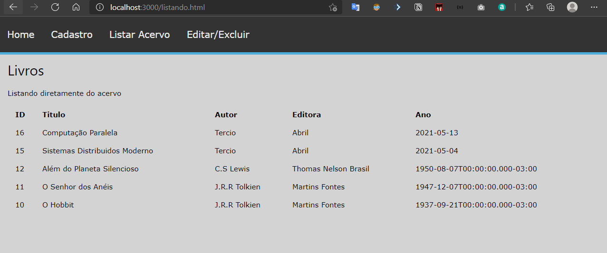

# SD - Web Services

Projeto da disciplina *Sistemas Distribuídos* do curso de *Ciência da Computação - UFAL - Campus Arapiraca*

* Professor: Tércio de Morais Sampaio Silva
* Alunos: 
    * Júlio Miguel de Souza Costa
    * Paulo Henrique da Silva Santos

### Requisitos
> Desenvolver uma aplicação cliente/servidor usando Web services e o estilo arquitetural REST

### Aplicação: Gerenciador de Livros 

<p align="center">
    
</p>

A aplicação conta com o backend (rest api) desenvolvido com auxilio do framework [adonis](https://adonisjs.com/). 

A parte cliente da aplicação utilizou-se o [axios](https://github.com/axios/axios) via CDN para consumir a api.

### Backend: 

#### Endpoints

Endpoint base `http://127.0.0.1:7000`

###### `POST` -> `http://127.0.0.1:7000/livros`
Corpo da requisição deve seguir o formato abaixo:

```json
{
  "titulo": "O Silmarilion",
  "autor": "J.R.R Tolkien",
  "editora": "Martins Fontes",
  "ano": "02/03/1998"
}
```

###### `GET` -> `http://127.0.0.1:7000/livros`
Lista todos os livros disponíveis no acervo

```json
[
  {
    "id": 15,
    "titulo": "Sistemas Distribuidos Moderno",
    "autor": "Tercio",
    "editora": "Abril",
    "ano": "2021-05-04",
    "created_at": "2021-05-29T23:18:58.000-03:00",
    "updated_at": "2021-05-29T23:18:58.000-03:00"
  },
  {
    "id": 11,
    "titulo": "O Senhor dos Anéis",
    "autor": "J.R.R Tolkien",
    "editora": "Martins Fontes",
    "ano": "1947-12-07T00:00:00.000-03:00",
    "created_at": "2021-05-27T21:41:17.000-03:00",
    "updated_at": "2021-05-27T21:41:17.000-03:00"
  },
  {
    "id": 10,
    "titulo": "O Hobbit",
    "autor": "J.R.R Tolkien",
    "editora": "Martins Fontes",
    "ano": "1937-09-21T00:00:00.000-03:00",
    "created_at": "2021-05-27T21:41:17.000-03:00",
    "updated_at": "2021-05-27T21:41:17.000-03:00"
  }
]
````
###### `GET` -> `http://127.0.0.1:7000/livros/:id`
Procura por um livro específico através do id. 
Abaixo um exemplo para requisição com id = 15

```json
[
  {
    "id": 15,
    "titulo": "Sistemas Distribuidos Moderno",
    "autor": "Tercio",
    "editora": "Abril",
    "ano": "2021-05-04",
    "created_at": "2021-05-29T23:18:58.000-03:00",
    "updated_at": "2021-05-29T23:18:58.000-03:00"
  }
]
````
###### `PUT` -> `http://127.0.0.1:7000/livros/:id`
Atualiza um livro especificado pelo id. 
Abaixo segue um exemplo para atualizar o título do livro de id = 15

```json
{
	"titulo": "Sistemas Distribuidos Ultra Moderno"
}
```
###### `DELETE` -> `http://127.0.0.1:7000/livros/:id`
Deleta um livro de acordo com o id especificado

### Frontend

###### Consumindo api com o verbo post

```javascript

/*
Detalhes de implementação estão nos respectivos arquivos
*/
axios.post('http://127.0.0.1:7000/livros',livro)
        .then(res => alert(res.data.message)) //alerta mensagem
        .catch(err => alert(err))   //alerta de erro
```

###### Consumindo api com o verbo get

```javascript
/*
Detalhes de implementação estão nos respectivos arquivos
*/
const result = await axios.get(`http://127.0.0.1:7000/livros/${campoPesquisa.value}`)
```
###### Consumindo api com o verbo put

```javascript
/*
Detalhes de implementação estão nos respectivos arquivos
*/
const result = await axios.put(`http://127.0.0.1:7000/livros/${campoId.value}`, livro)
```

###### Consumindo api com o verbo delete

```javascript
/*
Detalhes de implementação estão nos respectivos arquivos
*/
const result = await axios.put(`http://127.0.0.1:7000/livros/${campoId.value}`)
```
### Instruções para executar este projeto

Node.js >= 14.15.4 e npm >= 6.0.0

#### Execução da api

Dentro do diretorio crie um .env de acordo com o .env.exemple. Nesse arquivo fica as configurações gerais do projeto como porta, banco de dados etc.

Antes de inicializar a api é importante instalar todos os pacotes necessários, para isto, dentro do diretorio abra o terminal e digite o comando abaixo:

```console
npm install
```

Após instalado todos os pacotes, precisaremos deixar o banco de dados sqlite pronto. Então, em um terminal digite:

```console
node ace configure @adonisjs/lucid
```
Escolha o banco sqlite pressionando a tecla espaço e depois enter para confirmar a escolha.

Para criar os schemas, basta executar a migration com o seguinte comando:

```console
node ace migration:run
```
Vamos subir alguns dados de exemplo para o banco (seeders):

```console
node ace db:seed

```
*Por fim* :tada: , vamos executar a aplicação (modo desenvolvimento, para simplificar):

```console
node ace serve --watch
```

#### Execução do frontend

Dentro do diretorio do frontend, vamos digitar os seguintes comandos:

```console
npm install
```
Para executar o projeto:

```console
npm run start
```

Em seu navegador acess: `http://localhost:3000/index.html` e tudo certo :tada:
